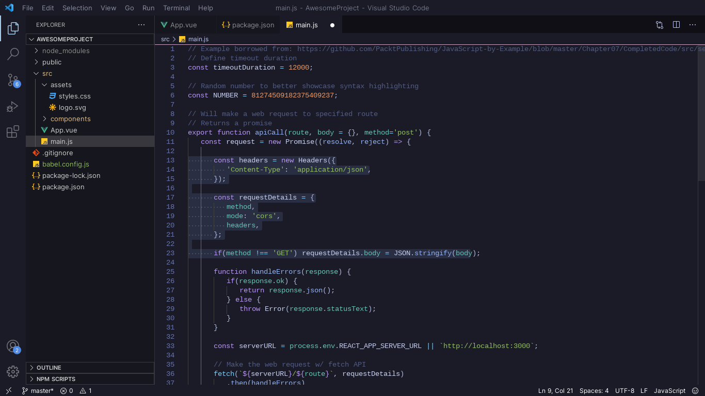

# LunarVim Theme for Visual Studio Code

Install Link: [LunarVim Dark Theme - Visual Studio Marketplace](https://marketplace.visualstudio.com/items?itemName=JuniorSchmidt.lunar-vscode-theme)

## Description

The LunarVim Dark Theme is a sleek and stylish dark theme for Visual Studio Code. It draws inspiration from the elegant color scheme of the LunarVim project. If you appreciate LunarVim's aesthetics, you'll love this theme for your development environment.

## Features

- Elegant and soothing color palette.
- Designed to reduce eye strain during long coding sessions.
- Inspired by the LunarVim project's aesthetics.
- Enhances code readability and overall coding experience.

## Installation

You can easily install the LunarVim Dark Theme via the Visual Studio Code extensions marketplace.

1. Open Visual Studio Code.
2. Go to the Extensions view by clicking on the Extensions icon in the Activity Bar on the side of the window.
3. Search for "LunarVim Dark Theme."
4. Click the "Install" button to add it to your list of installed extensions.

## Usage

Once installed, follow these simple steps to activate the LunarVim Dark Theme:

1. Open Visual Studio Code.
2. Click on the gear icon in the lower left corner to open Settings.
3. In the search bar, type "Color Theme" and select "Preferences: Color Theme."
4. Choose "LunarVim Dark Theme" from the available themes.

That's it! Your Visual Studio Code editor will now be adorned with the elegant LunarVim Dark Theme.

## Screenshots

## About the Author

LunarVim Dark Theme is maintained by Junior Schmidt. If you have any feedback, suggestions, or issues to report, feel free to reach out. Your input is highly appreciated.

## Contribute

If you'd like to contribute to the development or improvement of the LunarVim Dark Theme, visit our [GitHub repository](https://github.com/JrSchmidtt/lunar-vscode-theme).

## License

This extension is free to use and open-source. It is distributed under the [MIT License](LICENSE.md).

---

Thank you for choosing the LunarVim Dark Theme for Visual Studio Code. We hope it enhances your coding experience and makes your development environment more pleasant. If you enjoy the theme, please consider leaving a review or rating it in the Visual Studio Code marketplace. Your support is invaluable. Happy coding! 🚀
